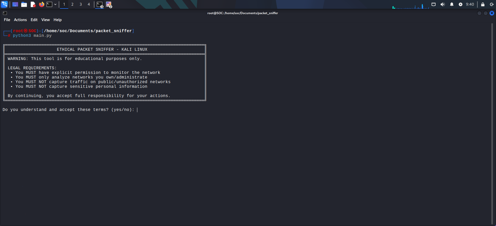
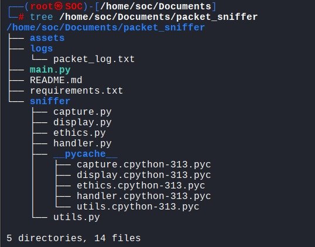
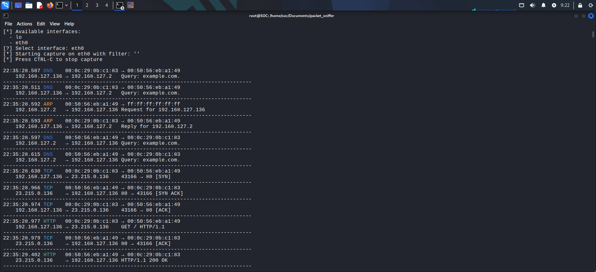
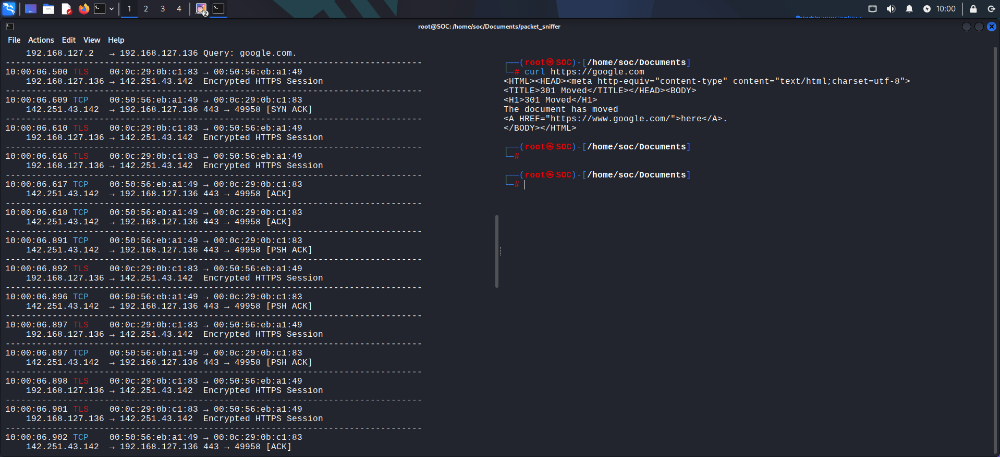
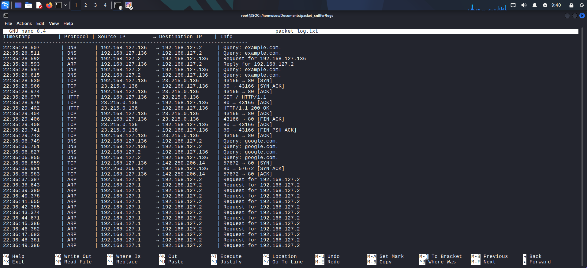

# 🛡️ Packet Sniffer Tool – Network Traffic Analyzer (Educational Use Only)



## 📌 Overview

This project is a **custom-built Packet Sniffer** developed for **educational and ethical use only**. It captures live network packets, analyzes them in real-time, and logs essential metadata like source/destination IP addresses, protocols, and payload data in a structured format.

The tool serves as a foundational project for those learning about **network security**, **packet analysis**, and **ethical hacking**.

---

## 🎯 Features

- 📡 Real-time packet capturing via `scapy`
- 🔍 Extracts and logs:
  - Source & Destination IP addresses
  - Protocols (TCP, UDP, ICMP, etc.)
  - Payload content (hexadecimal)
- 🗂 Logs are stored neatly in `logs/capture_log.txt`
- 🖼 GUI-less, terminal-friendly interface
- 🔐 Developed for ethical, educational purposes only

---

## 🖼️ Screenshots

### ✅ Project Structure


### 🌐 Live Packet Capture


### 🌀 Traffic Generated Using Browser


### 📝 Logs Output with Labels


---

## 🛠️ How It Works

The project contains two primary modules:

### 1. `capture.py`
- Starts the live packet capture using `scapy.sniff()`
- Filters and forwards packets to the handler
- Logs the processed data in a labeled, readable format

### 2. `utils.py`
- Parses each packet
- Detects IP/TCP/UDP/ICMP layers
- Extracts payload (if available) and logs it with timestamps

---

---

## 🚀 Getting Started

### ✅ Requirements
- Python 3.x
- [Scapy](https://scapy.readthedocs.io/en/latest/) (`pip install scapy`)

### 🔧 Run the Tool

```bash
# Step 1: Install dependencies
pip install scapy

# Step 2: Run the packet sniffer (requires sudo/admin for raw socket access)
python main.py

Educational Use Only
⚠️ This tool is built strictly for educational and ethical use.

Do not use this on networks you don’t own or have explicit permission to monitor.

🤝 Contributing
Contributions, improvements, and feature enhancements are welcome! Open a pull request or submit issues.

📄 License
This project is released under the MIT License. See LICENSE for more details.


